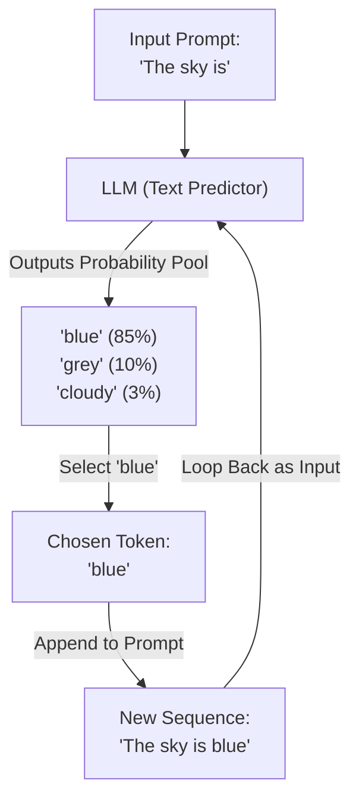

By the end of this lesson, you should be able to explain how a Large Language Model (LLM) works at its absolute core: predicting the next piece of text from what came before.

## Quick Summary

- An LLM is a next-token prediction engine.
- It learns patterns from reading massive amounts of text.
- Autocomplete at scale looks like reasoning, but the underlying mechanic is always token selection.

## Comic Script: Tess's Autocomplete Adventure

<ComicStrip>
  <ComicPanel character="Tess" title="Predicting the Future">
    <SpeechBubble speaker="Tess">So I don't write sentences all at once? I just guess what word comes next?</SpeechBubble>
    **Visual action:** Tess sits at a typewriter, printing the letters "Once upon a...". A set of bubbles float above her head containing "time" (90%), "day" (5%), "place" (3%).

    **Teaching point:** Models do not write sentences as pre-planned blocks. They generate text token by token.
  </ComicPanel>
  <ComicPanel character="Tess" title="The Pattern Library">
    <SpeechBubble speaker="Tess">And I know these probabilities because I read the whole internet?</SpeechBubble>
    **Visual action:** Tess walks past towering shelves of books glowing with connection lines. A computer screen shows statistics matching word patterns.

    **Teaching point:** The probabilities are not random; they are learned from patterns in training data.
  </ComicPanel>
</ComicStrip>

## The Scale of Autocomplete

At its heart, a large language model is an advanced version of the autocomplete on your smartphone keyboard. 

When you type a sentence, the model calculates the probability of every word in its vocabulary being the next word. It does this by leveraging a vast web of patterns it discovered while reading trillions of sentences during its training phase. 

<ELI5Card title="An LLM is a giant guessing game">
  If you play the sentence game "I'm going to eat a slice of...", you might guess "pizza" or "cake". You probably wouldn't guess "tractor". An LLM uses mathematics to do the exact same thing across thousands of concepts.
</ELI5Card>

## Reasoning or Just Guessing?

This autocomplete mechanic sounds simple, but when you scale it up to models with billions of parameters trained on nearly all human writing, something amazing happens. To accurately predict the next word in a complex coding problem, a medical diagnosis, or a legal contract, the model has to "understand" the context. 

Thus, next-word prediction naturally forces the model to learn logic, grammar, reasoning, and factual relationships.

<Callout variant="tip" title="Analogy breakdown: Autocomplete vs LLM">
  Your phone's autocomplete only looks at the last 1 or 2 words. A modern LLM can look at hundreds of pages of context (the context window) to decide the next word. However, it still operates one step at a time; it has no hidden planner drafting future sentences in parallel.
</Callout>

## The Machinery: Training Data, Parameters, and Loops

To understand how an LLM makes these predictions, we need to introduce three key terms:

1. **Training Data (The Internet Library)**: Before a model can predict the next word, it needs to study patterns. Models are fed billions of pages of text—novels, code repositories, websites, and articles. By scanning these documents, it learns that `"bacon and"` is usually followed by `"eggs"`, and that `"E = mc"` is followed by `"²"`.
2. **Parameters (The Radio Dials)**: An LLM is not a database of rules; it is a giant mathematical formula. Inside this formula are billions of variables called parameters (or weights). During training, these parameters are fine-tuned. 
3. **Autoregressive Generation (The Loop)**: The model outputs exactly *one* token at a time. Once a token is chosen, it is appended to the end of the prompt, and the entire sequence is fed back into the model to predict the *next* token. This process loops repeatedly.

### The Autoregressive Generation Loop
This diagram illustrates how the model iteratively predicts and builds its own output, token by token:

<ELI5Card title="Parameters are like dials on a radio">
  Imagine a giant radio with 100 billion dials. If you turn them randomly, all you hear is static. But if you spend weeks tuning them to match the broadcasting signal, you suddenly get crystal-clear music. In an LLM, training is the process of adjusting those billions of dials so the math outputs coherent language instead of random words.
</ELI5Card>

## Try It: Predict the Next Word

In this game, try to guess which word the model predicts will come next. See if your intuition matches the model's actual top-5 probabilities.

<PredictiveWordGame />

## Remember

<RememberCard>
  - An LLM generates text one step at a time.
  - The model calculates probabilities for all possible next words.
  - Scaled autocomplete mimics human reasoning.
  - The model does not rewrite or edit its past outputs; it must build on them.
</RememberCard>

export const introQuiz = [
  {
    question: "What is the core task an LLM is trained to perform?",
    options: [
      "Translating code to English",
      "Predicting the most likely next token in a sequence",
      "Searching a database for facts",
      "Editing human text for grammatical errors",
    ],
    correctIndex: 1,
    explanation:
      "All generative models are trained to complete sequences of tokens by predicting the next token over and over.",
  },
  {
    question: "How is an LLM different from your phone's basic autocomplete?",
    options: [
      "It reads your mind directly",
      "It considers a massive context window of previous text and uses deep patterns, rather than just the last 1-2 words",
      "It doesn't use probability",
      "It generates a whole paragraph in a single parallel step",
    ],
    correctIndex: 1,
    explanation:
      "While the step-by-step autocomplete mechanic is the same, LLMs use deep neural networks to weigh hundreds of pages of context.",
  },
];

<Quiz title="Intro: check your understanding" questions={introQuiz} />
