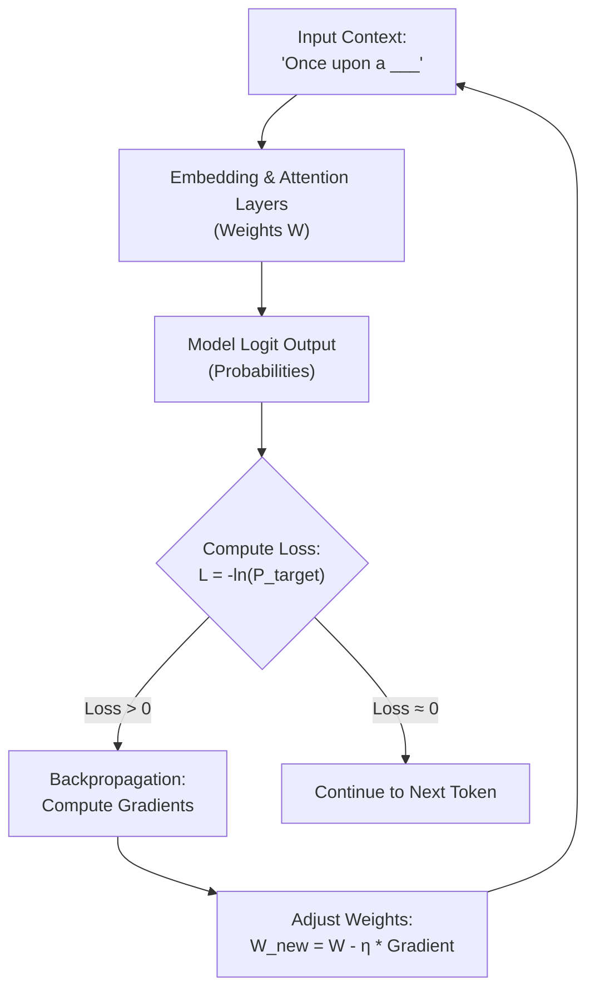

Pre-training is the first and most expensive stage of building a large language model. This is where the model reads massive amounts of text to learn patterns, facts, and logic.

## Quick Summary

- Pre-training utilizes self-supervised learning on massive text databases.
- The loss function evaluates predictions, adjusting internal weights via backpropagation.
- Compute scaling laws state that model capability depends on compute budget, parameters, and tokens.

---

## The Birth of Weights: Initialization

Before training starts, a model is an empty architecture—a network of equations with empty parameters. All of its billions of parameters (weights) are randomized, usually using Gaussian distributions.
If you type "Once upon a..." into a newly initialized model, it might guess "refrigerator" or "banana". It has no concept of language or facts.

During pre-training, the model reads billions or trillions of tokens. For every token it reads, it attempts to guess the next token. If its guess is wrong, a mathematical feedback signal updates the weights.

<ELI5Card title="An autocomplete with a grade">
  Imagine you are learning a foreign language by reading books. For every word you read, you try to predict the next word before turning the page. At first, you guess randomly. But every time you turn the page and see the real word, you correct your mental rules. After reading millions of pages, your guesses become highly accurate.
</ELI5Card>

---

## The Math: Cross-Entropy Loss

To grade predictions, the model uses a formula called **Cross-Entropy Loss**. 

Suppose the model outputs a probability distribution over its vocabulary for the next word. The true target word has an index $y$, and the model predicted a probability $P(x_y)$ for that word. The loss $L$ for this single step is calculated as:

$$L = -\ln(P(x_y))$$

Where:
* $P(x_y)$ is the probability assigned to the correct word.
* $\ln$ is the natural logarithm.

### How the Loss Guides Learning:
* **If $P(x_y) \approx 1.0$ (High confidence in correct answer)**: The loss is close to $0$. The weights are left alone because the model predicted correctly.
* **If $P(x_y) \to 0$ (Low confidence in correct answer)**: The loss approaches infinity. A massive correction signal is calculated and sent backward through the network (a process called **backpropagation**). This mathematically adjusts the weights so that next time, the correct token gets a higher probability score.

---

## Compute Scaling Laws & Training Scale

Pre-training requires astronomical amounts of data and compute. For example, training a state-of-the-art model like **Llama 3 70B** requires:
* **Data**: Over **15 Trillion tokens** (a dataset of text 7.5 times larger than Llama 2).
* **Compute**: Roughly **$2.4 \times 10^{25}$ FLOPs** (floating-point operations) of calculations.
* **Hardware**: Running **24,000 H100 GPUs** continuously for several months, consuming megawatts of electricity and costing millions of dollars.

### The Chinchilla Scaling Laws
In 2022, researchers at DeepMind published the **Chinchilla scaling laws**, which established how to distribute a compute budget optimally between parameters ($N$) and training data ($D$):
* **Compute-Optimal Ratio**: To get the maximum model capability for a given FLOP budget, the parameter count $N$ and the number of training tokens $D$ should be scaled in a $1:1$ proportion. This mathematically translates to training with roughly **20 tokens per parameter** (e.g. an 8B parameter model is compute-optimal at 160B tokens).
* **Overtraining in Practice**: While 20 tokens per parameter is optimal *during training*, it is often better to train smaller models for *longer* on more data (e.g. Llama 3 8B was trained on 15T tokens—which is over **1,800 tokens per parameter**!). Even though this is "compute-inefficient" during training, it produces a highly compressed 8B model that is incredibly cheap and fast to query millions of times in production.

<CompareTable
  columns={["Metric", "What it represents", "Engineering tradeoff"]}
  rows={[
    ["Parameters (N)", "The count of adjustable weights inside the model (e.g. 8B, 70B).", "More parameters increase reasoning capacity, but require significantly more GPU memory to load during inference."],
    ["Dataset Size (D)", "The volume of tokens the model reads (e.g. 15 Trillion tokens).", "More tokens yield stronger intuition and lower inference costs, but require longer pre-training runs."],
    ["Compute Budget (C)", "Total floating-point calculations performed (FLOPs).", "Sets the upper bound on how large a model can be trained. Governed by GPU count, time, and electricity."]
  ]}
/>

---

## Remember

<RememberCard>
  - Pre-training uses raw text to learn statistical links between tokens.
  - Weights start random and are adjusted by minimizing cross-entropy loss.
  - Compute scaling laws dictate that data size must grow alongside parameter size.
</RememberCard>

---

## Read More
* [Chinchilla Scaling Laws Paper (Hoffmann et al., 2022)](https://arxiv.org/abs/2203.15556)
* [Attention Is All You Need Paper (Vaswani et al., 2017)](https://arxiv.org/abs/1706.03762)
