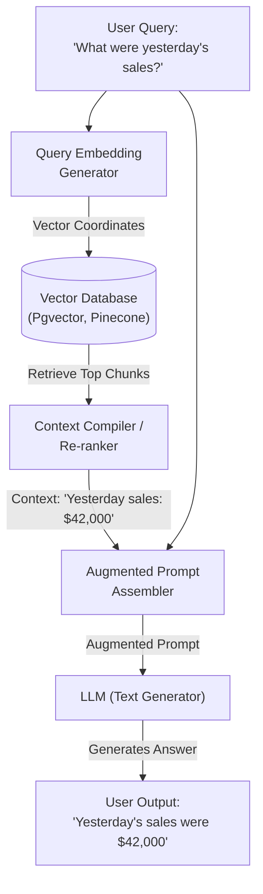

A common point of confusion for beginners is why a model trained on billions of parameters can't answer simple questions about current events, or why it hallucinatingly makes up details about a new software release.

## Quick Summary

- The training cutoff date represents the moment a model's pre-training run concluded.
- Retraining models to update minor facts is prohibitively slow and expensive.
- Retrieval-Augmented Generation (RAG) injects current facts directly into the prompt context at runtime.

---

## The Knowledge Cutoff Problem

During pre-training (Chapter 2.1), the model builds its internal weights by scanning a static snapshot of the internet. Once training is complete, the weights are frozen. 
* If a model finished training in **May 2026**, its weights contain no connections for events, papers, or code written in **June 2026**.
* If you ask it: "Who won the game yesterday?", the model is forced to guess (hallucinate) based on older historical patterns, because it has no mechanism to browse its weights for new facts.

Updating a model's weights to learn new facts by fine-tuning is extremely difficult. Fine-tuning excels at changing *style* and *formatting* (Chapter 2.2), but is highly prone to **catastrophic forgetting** (where learning new facts causes the model to overwrite older, unrelated facts).

---

## The RAG Solution: Open-Book Exam

Rather than trying to force the model to memorize the entire universe, we switch the model from a **closed-book exam** to an **open-book exam** using a three-step pipeline:

The steps inside this loop are:
1. **Retrieve**: We embed the user's query and perform a similarity search in a vector database to find the most relevant document chunks.
2. **Augment**: We compile the matched text chunks directly into the model's system prompt (surrounding the question with verified context).
3. **Generate**: We pass this combined prompt to the LLM. The model reads the context using attention layers to output a factual, grounded response.

By placing the raw source material directly into the **Context Window (Chapter 1.4)**, the model's self-attention heads (Chapter 1.3) can bridge the gap. Instead of guessing from pre-trained weights, it summarizes the verified facts visible in its prompt.

<ELI5Card title="An open-book exam vs memorization">
  If you ask a student to recite the exact census numbers of a town from memory, they will likely guess wrong. But if you hand them the census sheet and ask them to copy down the number, they will copy it perfectly. RAG is the act of handing the sheet to the model.
</ELI5Card>

---

## Remember

<RememberCard>
  - Models are frozen in time; their weights do not automatically update.
  - Fine-tuning is a poor way to teach models new, dynamic facts.
  - RAG turns questions into open-book lookups by inserting verified documents into the prompt context.
</RememberCard>

---

## Read More
* [Retrieval-Augmented Generation for Knowledge-Intensive NLP Tasks (Lewis et al., 2020)](https://arxiv.org/abs/2005.11401)
