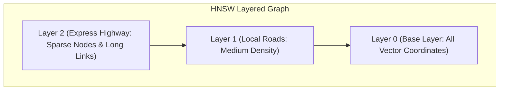

To feed documents into an LLM context, we cannot paste a 500-page PDF manual—it would exceed the token budget and cause "Lost in the Middle" decay. We must split it into bite-sized pieces.

## Quick Summary

- Chunking divides large files into smaller, semantically coherent text blocks.
- Vector databases index these text blocks using embedding coordinates.
- Similarity search calculates the mathematical distance between vectors to retrieve matches.

---

## Chunking Strategies

**Chunking** is the process of breaking text down into smaller paragraphs or segments before indexing them:

1. **Fixed-Size Chunking**: Splits text strictly by token or character counts (e.g. exactly 500 characters, with 50 characters of overlap). It is simple and fast, but frequently splits sentences in half, destroying the semantic context.
2. **Semantic Chunking**: Analyzes the text and splits it only when a significant shift in meaning occurs (e.g. at section headers or paragraph breaks).
3. **Parent-Child Chunking**: Splits documents into tiny child chunks (e.g. 100 tokens) for vector search, but links them to larger parent chunks (e.g. 1000 tokens) containing the full surrounding context. When a child matches, we feed the parent to the LLM.

### Sliding Window Chunking Layout
To preserve context boundaries, fixed-size chunking uses an **overlap** of tokens, acting as a sliding window:

```
Document:  [ Token 1  Token 2  Token 3  Token 4  Token 5  Token 6  Token 7  Token 8 ]

Chunk 1:   [ Token 1  Token 2  Token 3  Token 4  Token 5 ]  (Size: 5 tokens)
                                 └──── Overlap: 2 tokens ────┐
Chunk 2:                        [ Token 4  Token 5  Token 6  Token 7  Token 8 ] (Size: 5 tokens)
```

<Callout variant="tip" title="Bad chunking = bad RAG">
  If you split the phrase `"Do not press the red button. It will cause a meltdown."` into two chunks:
  * Chunk 1: `"Do not press the red button."`
  * Chunk 2: `"It will cause a meltdown."`
  
  Searching for "meltdown" will retrieve Chunk 2, but the critical warning instruction in Chunk 1 is completely lost! Parent-child chunking solves this by keeping the context intact.
</Callout>

---

## Vector Databases: Filing Cabinets for Meaning

Once text is chunked, each chunk is passed through an **Embedding Model** (Chapter 1.2) to generate a high-dimensional vector. These vectors are stored in a **Vector Database** (like Pgvector, Pinecone, Chroma, or Qdrant).

Unlike traditional databases that look up indexes by ID or exact text matching, vector databases index coordinates. Because performing a brute-force linear search ($O(N)$ comparisons) across millions of high-dimensional vectors is too slow, databases use specialized indexing structures:



* **HNSW (Hierarchical Navigable Small World)**:
  * Creates a multi-layered graph resembling a skip-list.
  * The top layers contain few vectors with wide connections for quick routing across coordinate space.
  * The search navigates down through the layers, landing on the bottom layer containing all vectors to locate the exact nearest neighbors in $O(\log N)$ logarithmic time.
* **IVF (Inverted File Index)**:
  * Partitions the high-dimensional space into clusters using $K$-Means clustering.
  * Each incoming query vector is compared only against the centroids of the nearest clusters (controlled by the $n_{\text{probe}}$ hyperparameter), skipping the rest of the database entirely. This provides sub-millisecond search speeds at the cost of a tiny fraction of recall accuracy.

---

## Distance Metrics

To find the closest chunks, the database computes the distance between the user's query vector and the stored document vectors using one of three metrics:

$$\text{Cosine Similarity} = \frac{A \cdot B}{\|A\| \|B\|}$$

* **Cosine Similarity**: Measures the cosine of the angle between two vectors. It is scale-invariant, making it ideal for text comparison where document length varies.
* **Dot Product**: Multiplies corresponding components. Extremely fast, but requires all vectors to be normalized to a length of 1 first.
* **L2 Distance (Euclidean)**: Measures the straight-line distance between the arrow tips. Good for fixed-scale numerical vectors, but sensitive to magnitude differences.

<CompareTable
  columns={["Metric", "Formula focus", "Best use case"]}
  rows={[
    ["Cosine Similarity", "Measures the angle between arrows (ignores length).", "Standard text semantic searches where chunks vary in length."],
    ["Dot Product", "Multiplies coordinate magnitudes directly.", "High-throughput systems where embedding vectors are pre-normalized."],
    ["L2 Euclidean", "Measures literal distance between coordinate points.", "Image embeddings or dense physical spatial coordinates."]
  ]}
/>

---

## Remember

<RememberCard>
  - Chunking prepares raw text so it fits comfortably inside the context window.
  - Parent-child chunking searches small snippets but feeds larger context paragraphs to the LLM.
  - HNSW graphs enable sub-millisecond retrieval across millions of dense vectors.
  - Cosine similarity evaluates meaning by measuring the angle between coordinate arrows.
</RememberCard>

---

## Read More
* [Hierarchical Navigable Small World (HNSW) Paper (Malkov & Yashunin, 2016)](https://arxiv.org/abs/1603.09320)
