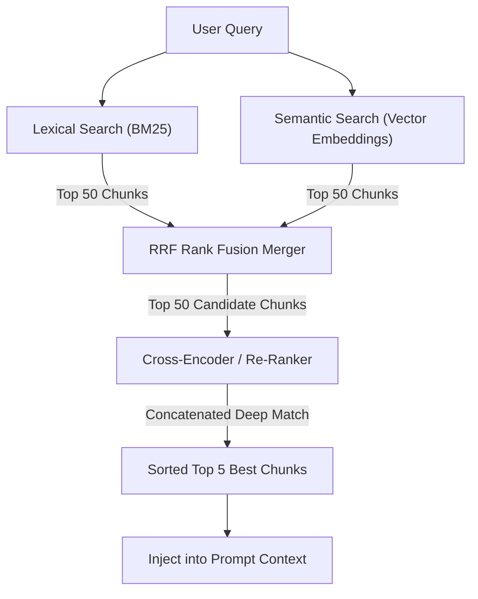

While semantic search is incredibly powerful, relying *only* on embedding vectors is a common engineering mistake. Vector search is excellent at identifying "concepts," but terrible at finding exact terms, serial numbers, or acronyms.

## Quick Summary

- Hybrid search combines <abbr title="Best Matching 25">BM25</abbr> keyword matching with vector semantic search.
- Reciprocal Rank Fusion (RRF) merges keyword results with vector results.
- Cross-encoders (re-rankers) evaluate candidate pairs to sort the most relevant results at the top.

---

## Why Pure Vector Search Fails

Suppose a user searches a company database for: `"Error code SDK-404"`.
* **Embedding Model**: Sees `SDK-404` as an out-of-vocabulary token or a generic code term. It associates the vector with "software error logs" or "HTTP not found".
* **The Result**: The vector database returns articles about generic web errors, completely missing the specific PDF instruction manual for `SDK-404` because the semantic vectors were too far apart.

For exact matches, code variables, usernames, or serial numbers, classic **keyword search** (lexical search) is far superior.

---

## Hybrid Search: Lexical + Semantic

**Hybrid Search** runs two queries in parallel and merges the results:

1. **Lexical Query (<abbr title="Best Matching 25">BM25</abbr>)**: Evaluates term frequency and document frequency. If the document contains the exact string `SDK-404`, it gets a high score.
2. **Semantic Query (Embeddings)**: Evaluates concept similarity. If the query asks about "lost connection issues", it finds articles containing "timeout" or "offline".

### Reciprocal Rank Fusion (RRF)
To merge these lists, we use **Reciprocal Rank Fusion (<abbr title="Reciprocal Rank Fusion">RRF</abbr>)**. RRF scores documents based on their position in both lists, rather than trying to combine raw scoring scales:

$$RRF(d) = \sum_{m \in M} \frac{1}{k + r_m(d)}$$

Where $r_m(d)$ is the rank of document $d$ in retriever $m$, and $k$ is a constant (typically 60) to prevent top ranks from completely dominating.

---

## The Re-ranking Step: Bi-Encoders vs. Cross-Encoders

Comparing a user query to thousands of document vectors is fast because we compare pre-computed vectors. However, this is a coarse approximation. To get maximum accuracy, we use a **two-stage retrieval funnel**:

### How They Compare:
* **Bi-Encoders (Coarse retrieval)**:
  * Embed the query and documents independently: $$\text{Vector}_{\text{query}} = E(\text{query})$$ and $$\text{Vector}_{\text{doc}} = E(\text{doc})$$.
  * The similarity is computed via a simple dot product or cosine angle of these vectors.
  * **Pros/Cons**: Extremely fast (vectors can be indexed and queried in sub-milliseconds), but less accurate because there is no cross-attention between the query words and document words during embedding.
* **Cross-Encoders (Fine-grained re-ranking)**:
  * Feed the query and document *together* into a transformer: $$\text{Score} = \text{Transformer}(\text{Query} + \text{ [SEP] } + \text{Document})$$.
  * Self-attention heads (Chapter 1.3) dynamically weight every token in the query against every token in the document.
  * **Pros/Cons**: Highly accurate at catching fine-grained relationships and logic, but too slow and computationally expensive to search across a large database (takes milliseconds per pair).

In production RAG systems, we use a **two-stage pipeline**:
1. **Retrieve (Fast)**: Use a Bi-Encoder and BM25 to narrow down 10,000,000 documents to the top 50 candidates.
2. **Re-rank (Accurate)**: Pass those 50 candidates through a Cross-Encoder, sorting the top 5 most relevant results to place at the very top of the prompt.

<ELI5Card title="A filtering funnel">
  Imagine you are looking for a house. First, a real estate site filters 10,000 listings to 50 candidate houses based on zip code and price (Bi-Encoder Retrieval). Then, you visit all 50 houses in person to inspect the rooms closely and pick the top 5 (Cross-Encoder Re-ranking).
</ELI5Card>

---

## Remember

<RememberCard>
  - Lexical search (BM25) excels at exact matches, acronyms, and product codes.
  - Hybrid search combines BM25 keyword matching with vector matching.
  - RRF merges search result lists using rank values.
  - Re-rankers run deep transformer comparisons over a small candidate list to sort the best context inputs.
</RememberCard>

---

## Read More
* [Reciprocal Rank Fusion (Cormack et al., 2009)](https://plg.uwaterloo.ca/~gvcormac/rrf.pdf)
