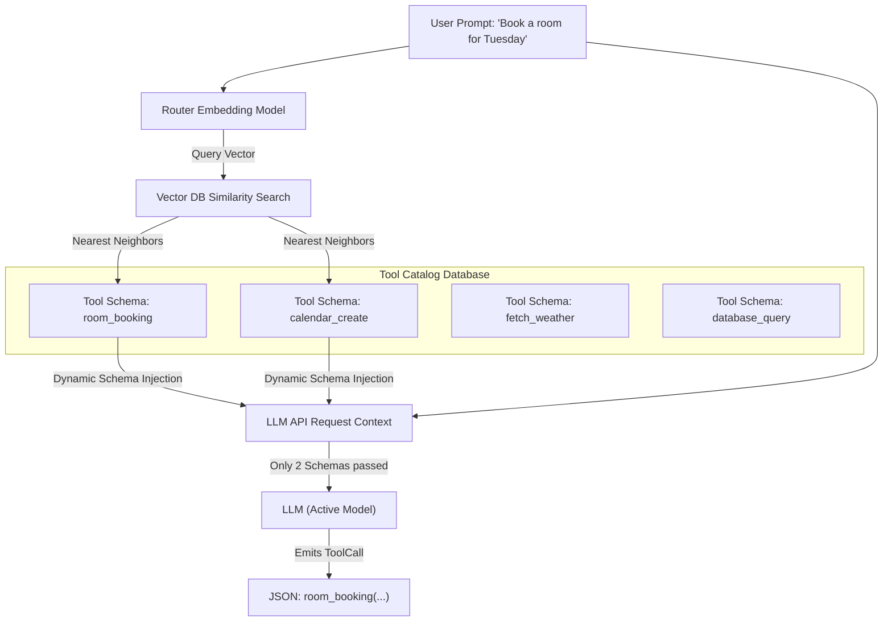

When building enterprise agentic systems, it is tempting to provide the model with a massive catalog of hundreds of tools so it can handle any task. However, this strategy quickly degrades accuracy.

## Quick Summary

- Passing too many tools (e.g. >15) increases model confusion and hallucination rates.
- Large tool lists consume valuable context window space.
- Tool routing filters the catalog to only pass the most relevant tool schemas to the model.

---

## The Too-Many-Tools Problem

When you attach tools to an API request, you are appending their JSON schemas directly to the prompt context. This has major consequences:
1. **Context Bloat**: If you pass 100 tool definitions, you might spend **10,000 tokens** declaring the schemas before the model even starts reading the user prompt!
2. **Attention Dilution**: The model's attention heads (Chapter 1.3) must distribute focus across all descriptions. If two tools sound similar (e.g. `query_postgres` vs `query_mysql`), the model is likely to select the wrong tool or mix parameter arguments.

---

## Semantic Tool Routing

To solve this, we implement a **Routing Layer** (also known as a dispatcher) in front of the model.

Instead of sending all 100 tools, we follow a three-step dispatch workflow:
1. **Index descriptions**: Store all function descriptions and metadata as coordinate vectors in a vector database (similar to document chunking in Chapter 4.2).
2. **Retrieve schemas**: When a user prompt arrives, embed it and perform a vector search to retrieve the **top 3 or 5 most similar tools** (e.g. matching "booking" matches `room_booking` and `calendar_create` but ignores database query tools).
3. **Declare to LLM**: We only write those 3–5 schemas in the final API request, hiding the other 95+ schemas.

This maintains high model accuracy, prevents token waste, keeps latency low, and reduces API costs.

---

## Remember

<RememberCard>
  - Do not dump hundreds of tools into a single request; models perform best with fewer than 10 choices.
  - Semantic routing uses vector searches to dynamically select which tools to present to the model.
  - Clear descriptions are essential for the router to match query embeddings accurately.
</RememberCard>

---

## Read More
* [Model Context Protocol (MCP) Design Specification](https://modelcontextprotocol.io/)

---

export const toolsQuiz = [
  {
    question: "Why should developers avoid declaring 100+ tools directly in a single model call?",
    options: [
      "Because the model will crash from too much code",
      "Because it bloats prompt context and dilutes self-attention, leading to higher selection errors",
      "Because models do not support more than 5 tools",
      "Because the database will reject the connection",
    ],
    correctIndex: 1,
    explanation:
      "Declaring too many tools consumes context space and dilutes attention, increasing selection errors. A routing layer helps by filtering tools dynamically.",
  },
  {
    question: "Who is responsible for executing the API or database code in a function calling loop?",
    options: [
      "The LLM provider's GPU cluster",
      "The client/server application harness hosting the orchestrator",
      "The model's attention heads",
      "The tokenizer",
    ],
    correctIndex: 1,
    explanation:
      "The LLM is only a text generator that outputs the structured parameter instructions. The developer's application code must catch this instruction and run the actual API or database command.",
  },
];

<Quiz title="Tools: check your understanding" questions={toolsQuiz} />
